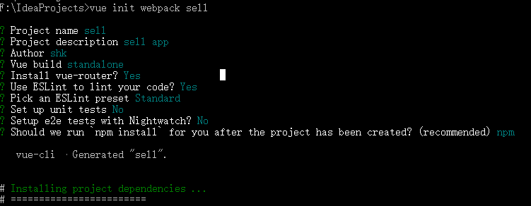

#### 一、该搭建方式是采用vue-cli脚手架进行的开发环境的搭建，使用该方式搭建做如下准备：

1.安装nodeJs，在这个过程中会顺带安装npm（nodeJs环境下的包管理器）  

2.为了提升后续开发中下载模块的速度，可以安装npm的淘宝镜像：  

    npm install -g cnpm --registry=https://registry.npm.taobao.org  
    
3.安装webpack(编译工具)：  

    [c]npm install webpack -g  
    
4.安装vue-cli：  

    [c]npm install vue-cli -g  

#### 二、开始使用vue-cli搭建项目

1.使用vue脚手架搭建  

    vue init webpack project-name

2.控制台会有如图所示参数配置的步骤

3.到这里项目骨架搭建已经完成，下面可以运行如下命令，进行项目运行测试

    cd sell
    npm run vue
    
4.最后在浏览器中访问localhost:8080，查看结果。

#### 三、vue2.0路由使用：

1.在组件页面添加路由标签

    <!-- 使用 router-link 组件来导航. -->
    <router-link to="/goods">商品</router-link>；
    
2.添加route-v

    <!-- 路由匹配到的组件将渲染在这里 -->
    <router-view></router-view>
    
3.在mai.js页面编写路由相关代码

    /* 将路由插件应用到vue上 */
    Vue.use(VueRouter);

    /* 定义路由组件，此处使用的是导入的组件 */
    const goods= { template: goods }
    
    /* 配置路由映射表 */
    const routes = [
      {path: '/goods', component: goods}
    ];

    /* 创建 router 实例，然后传 `routes` 配置 */
    const router = new VueRouter({
    	routes
    })

    /* 创建和挂载根实例 */
    new Vue({
      el: '#app',
      router: router,
      template: '<App/>',
      components: {
        App
      }
    });
    
四、模拟后台数据

1.在webpack.dev.conf.js编写引入数据相关的代码，在const portfinder = require(‘portfinder’)后添加

    const express = require('express')
    const app = express()//请求server
    const appData = require('../data.json')//加载本地数据文件
    const seller = appData.seller//获取对应的本地数据
    const goods = appData.goods
    const ratings = appData.ratings
    const apiRoutes = express.Router()
    app.use('/api', apiRoutes)//通过路由请求数据
    
2.编写数据路由，找到devServer,在里面加上before（）方法

     before(app) {
      app.get('/api/seller', (req, res) => {
        res.json({
          errno: 0,
          data: seller
        })//接口返回json数据，上面配置的数据seller就赋值给data请求后调用
      }),
        app.get('/api/goods', (req, res) => {
          res.json({
            errno: 0,
            data: goods
          })
        }),
        app.get('/api/ratings', (req, res) => {
          res.json({
            errno: 0,
            data: ratings
          })
        })
    }

五、设置1px的边框

1.编写1px的styl文件mixin.styl

    border-1px($color)
      position: relative
      &:after
        display: block
        position: absolute
        left: 0
        bottom: 0
        width: 100%
        border-top: 1px solid $color
        content: ' '

2.编写适应不同设备的缩放文件base.styl

    @media (-webkit-min-device-pixel-ratio: 1.5),(min-device-pixel-ratio: 1.5)
      .border-1px
      &::after
        -webkit-transform: scaleY(0.7)
        transform: scaleY(0.7)

    @media (-webkit-min-device-pixel-ratio: 2),(min-device-pixel-ratio: 2)
      .border-1px
      &::after
        -webkit-transform: scaleY(1)
        transform: scaleY(1)

3.在组件文件里引用

> 需要先在
